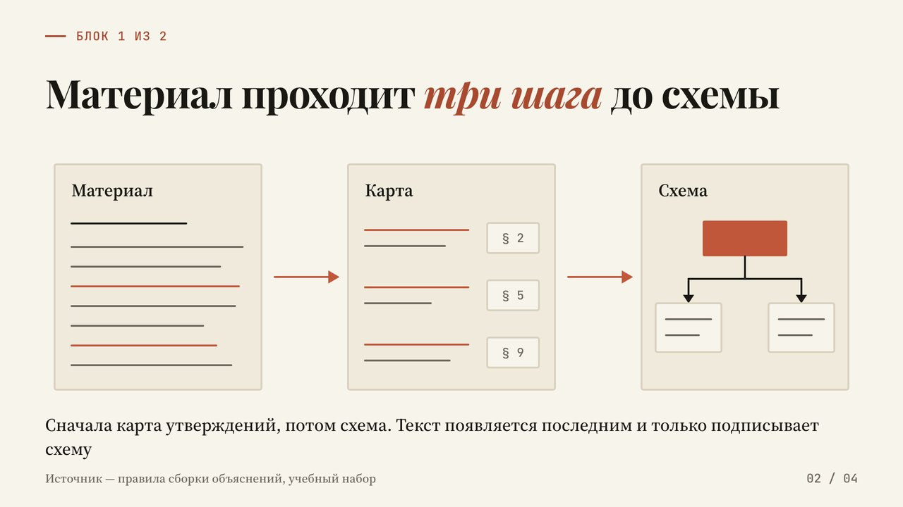
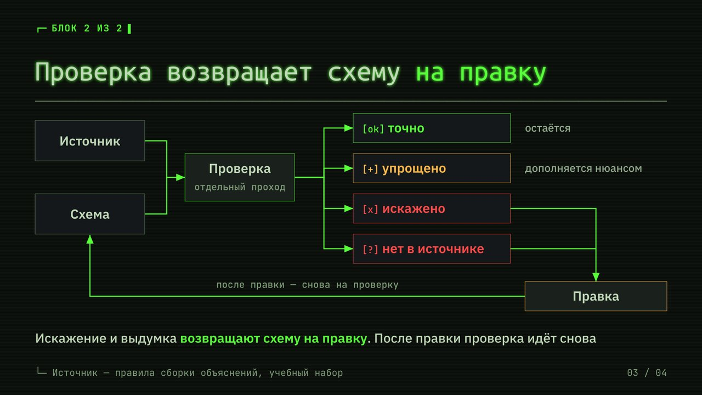
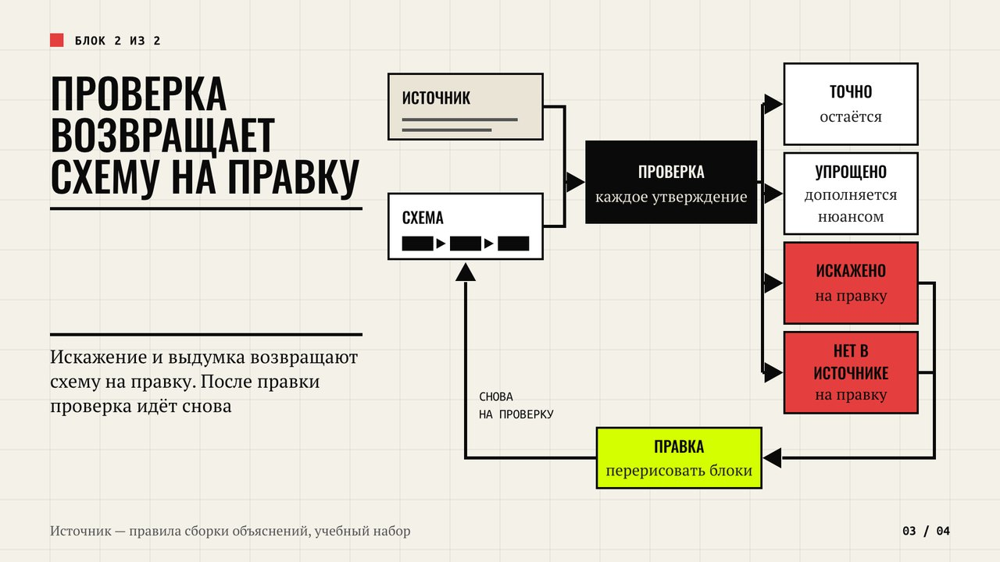
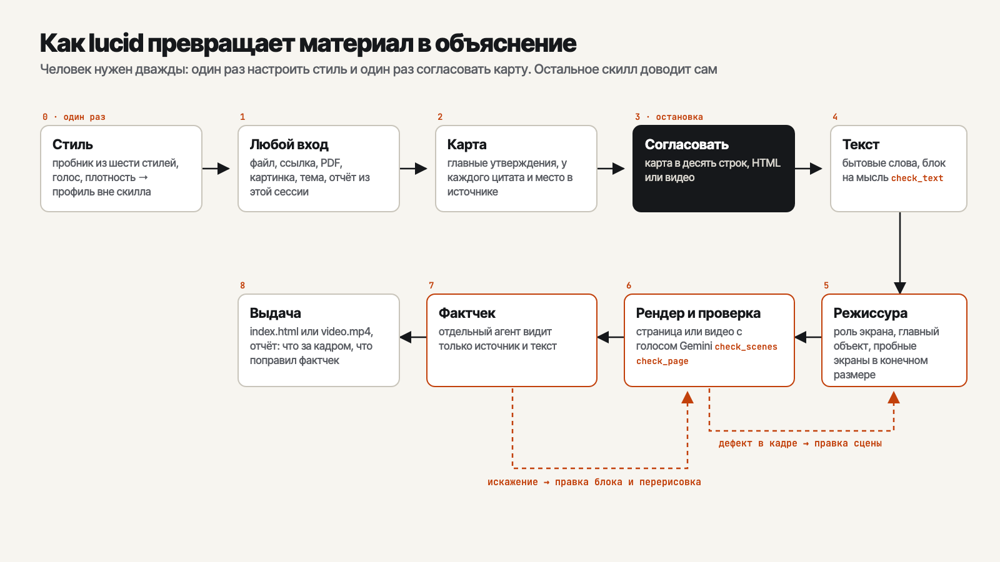

# Lucid

Скилл для [Claude Code](https://code.claude.com/docs), который делает сложный
материал понятным: из статьи, PDF, ссылки, отчёта или просто темы собирает
интерактивную страницу или видео с озвучкой. Каждая мысль показана схемой,
таймлайном, сравнением или ползунком, а не абзацем. У каждой есть место в
источнике, откуда она взята, а отдельная проверка ловит искажения до того,
как вы их увидите.

Идея взята из [поста Андрея Карпаты](https://x.com/karpathy/status/2105819303471976479)
от 2 октября 2026 года. Он выстроил лестницу форматов для понимания того, что
выдают языковые модели: текст на упрощённом техническом языке хуже схемы,
схема хуже интерактивной страницы, страница хуже видео-объяснения. Lucid
работает на двух верхних ступенях и держит две нижние внутри: текст в нём
написан короткими фразами и сам читается как схема.

## Одно объяснение, три стиля

Небольшой учебный материал о том, как объяснение собирается из источника и
проверяется. Скилл собрал его видео в трёх встроенных стилях: смысл, условия
и порядок появления одинаковые, а композиция, шрифты и движение у каждого
стиля свои.

**Журнальный светлый.** Процесс из трёх шагов: лист источника, карта
утверждений с якорями, схема.



**Терминал.** Самая плотная сцена: четыре исхода проверки и возврат на правку.



**Брутализм.** Та же сцена: асимметрия, тяжёлые рамки, кислотный цвет ровно
на одном объекте, но текст читается по тем же порогам размера и контраста.



Полное видео в журнальном стиле, 63 секунды с озвучкой:
[assets/readme/demo-editorial-light.mp4](assets/readme/demo-editorial-light.mp4).
Остальные кадры всех трёх стилей лежат рядом в `assets/readme/`.

## Что он делает

Вы приносите материал и говорите «объясни мне», «разжуй», «объясни как в
видео». Скилл выписывает главные утверждения с цитатами из источника,
показывает вам карту в десять строк и после «да» собирает объяснение:

- **Страницу**: один файл `index.html`, работает без сборки и без сервера.
  Пошаговые раскрытия, ползунки с формулой из источника, переключатели, у
  каждого блока раскрывашка «откуда это» с цитатой.
- **Видео**: Full HD, отдельный титульный экран, сцена на каждую мысль,
  детали появляются под слова диктора, голос Gemini.

Текст на языке того, кто спрашивает, даже если источник на другом. Слова
бытовые: термин из источника живёт в одной карточке с определением, а в
подписях его нет.

Стиль выбирается один раз. При первом запуске скилл показывает пробник:
одно объяснение в шести стилях, пробы голосов, вопрос про плотность текста.
Ответы ложатся в профиль вне скилла, и дальше все объяснения выходят в
одном почерке. Не подошёл ни один стиль — дайте ссылку на сайт или
скриншот, скилл соберёт пресет по нему.



## Зачем это, если можно просто попросить модель

Можно, и модель сделает красивую страницу. Красота здесь не главное. Обычно
получаются три вещи, которые мешают понять: схема говорит не то, что
источник, текст снова уползает в абзацы, а в видео подписи появляются
раньше рисунков и наезжают на линии.

| Что обычно получается | Что делает Lucid |
|---|---|
| Красивая схема с перепутанной причиной и следствием | **Якорь у каждого утверждения** и отдельный фактчек: агент, который не видел разговора, сверяет текст и данные схем с источником. Искажение возвращается на правку |
| Схема есть, но смысл несёт абзац рядом | **Текст как схема**: блок на одну мысль, подпись до двух предложений, проверка длины фраз и терминов скриптом |
| Термины и английские слова в скобках через строку | **Бытовые слова**: термин вводится один раз карточкой, оригинал в скобках только у названий |
| Каждый раз новый стиль под настроение модели | **Профиль стиля** один раз на онбординге, дальше все объяснения в нём |
| Мелкий текст в кадре, подпись раньше рисунка, текст на стрелке | **Проверка реального рендера** во времени: размер букв после всех масштабов, наложения, стрелки, контраст с поверхностью под текстом, порядок появления. Рендер не соберёт видео с дефектом |
| Шрифт без кириллицы молча заменён системным | **Проверка гарнитур по буквам самого текста**: подмена называется по имени |
| Таблица «проверено, всё точно» прямо на странице | **Фактчек отдельно**: его таблица в отчёте вам, а объяснение остаётся объяснением |

## Как устроено

| Шаг | Что происходит | Где подробно |
|---|---|---|
| **0. Стиль** | Онбординг один раз: пробник стилей, голос, плотность | `references/onboarding.md` |
| **1. Вход** | Любой материал, стабильная копия в `source.md` | `SKILL.md` |
| **2. Карта** | Утверждения с якорями, термины, числа, что за кадром | `references/writing-rules.md` |
| **3. Остановка** | Карта в десять строк, формат и объём | `SKILL.md` |
| **4. Текст** | Блоки, формы, нарратив для голоса; `check_text.py` | `references/writing-rules.md`, `references/visual-forms.md` |
| **5. Рендер** | Режиссура экранов, пробные кадры, страница или видео; `check_page.py`, `check_scenes.py` | `references/visual-quality.md`, `references/html-build.md`, `references/video-build.md` |
| **6. Фактчек** | Агент в чистом контексте, правка искажённого | `references/fact-check.md` |
| **7. Выдача** | Файл и отчёт: что за кадром, что поправлено | `SKILL.md` |

Остановка одна, на карте. Её можно снять словами «без остановки», если
формат и объём уже названы.

## Что нужно

**Для страницы:** Python 3.9+ и Playwright с Chromium, им проверяется
готовая страница:

```bash
pip3 install playwright && python3 -m playwright install chromium
```

**Для видео** дополнительно ffmpeg и ключ Gemini API для озвучки:

```bash
brew install ffmpeg          # macOS; на Linux — пакетный менеджер
```

Ключ выдаётся бесплатно в [Google AI Studio](https://aistudio.google.com/apikey).
Тарифы на озвучку смотрите там же. Положите ключ в переменную окружения или
в связку ключей macOS:

```bash
export GEMINI_API_KEY='<ключ>'
# или
security add-generic-password -a "$USER" -s lucid-gemini-api-key -w '<ключ>'
```

Нет ключа — скилл скажет, где его взять, и соберёт страницу вместо видео.

## Установка

Себе, для всех проектов:

```bash
git clone https://github.com/TimurUgulava/lucid ~/.claude/skills/lucid
```

В проект, для команды:

```bash
git clone https://github.com/TimurUgulava/lucid .claude/skills/lucid
```

## Как использовать

Говорите как обычно: «объясни мне эту статью», «хочу понять, как работает
X», «разжуй этот договор», «подай этот отчёт понятно», «сделай
видео-объяснение про…». Или `/lucid`. Первый запуск начнётся с выбора стиля.

Готовое объяснение ложится в `lucid/<дата>-<тема>/` текущего проекта.
Дальше точечно: «глубже блок 3», «короче», «переозвучь», «теперь видео».
Сменить стиль — «перенастрой стиль».

Проверки можно гонять и руками:

```bash
python3 scripts/check_text.py script.md --source source.md
python3 scripts/check_page.py index.html --shots .shots
python3 scripts/check_scenes.py --scenes scenes/scenes.json --audio-dir audio --shots .shots
```

## Что внутри

```
lucid/
├── SKILL.md                    ход работы, «готово, когда», разрешения, маршруты
├── references/
│   ├── onboarding.md           выбор стиля, голоса и плотности
│   ├── writing-rules.md        простые слова, текст как схема, формат карты и сценария
│   ├── visual-forms.md         десять форм под типы утверждений
│   ├── visual-quality.md       стандарт качества для всех стилей, рубрика ревью
│   ├── html-build.md           сборка страницы
│   ├── video-build.md          сборка видео: сцены, озвучка, рендер
│   ├── fact-check.md           задание агенту-проверяющему, формат отчёта
│   └── presets/                шесть стилей: токены, шрифты, раздел «Видео»
├── scripts/
│   ├── tts.py                  озвучка Gemini TTS, пробы голосов
│   ├── scenes_from_script.py   заготовки сцен и scenes.json из сценария
│   ├── render_video.py         покадровая запись и склейка, проверки до и после
│   ├── check_scenes.py         проверка кадров видео во времени и экспорта
│   ├── check_page.py           проверка страницы на 1920 и 390 px
│   └── check_text.py           длина фраз, термины, числа против источника
├── assets/                     каркасы страницы и сцен, витрина форм, пробник стилей
├── evals/                      триггеры, контрольные задачи, регрессия проверок
└── calibration/                место для ваших правок, чтобы скилл учился на них
```

## Как проверялось

**Регрессия проверок.** `evals/run_fixtures.py` собирает 17 контрольных
сцен. Двенадцать с намеренным дефектом: подпись на линии, подпись без
зависимостей, мелкий текст из-за масштаба SVG, плохой контраст на карточке,
перекрытие поздним слоем, неизвестный и скрытый объект, недетерминированная
перемотка, наложение абзацев, наконечник стрелки за изгибом, пересечение
линий, шрифт без кириллицы. Пять корректных, которые проверка не должна
трогать: текст в своей фигуре, подпись в группе объекта, декоративная
плоскость, узел ветвления, стрелка с достаточным плечом. Все 17 совпадают с
ожиданием в трёх прогонах подряд.

**Три стиля.** Учебный набор из `evals/content-set/` собран отдельными
агентами в стилях editorial-light, terminal и brutalist. У каждого четыре
сцены без дефектов по проверке кадров, видео 1920×1080 на 63 секунды,
декодируется без ошибок. По рубрике из пяти пунктов агенты поставили своим
кадрам от 4 до 5.

**Триггеры.** Четырнадцать запросов в чистом контексте, из них пять
соседних, которые скилл брать не должен: обучающий лендинг, презентация,
перевод, пересказ, вёрстка PDF. Все ушли куда надо.

Чего это не доказывает. Оценки по рубрике ставили модели, а не люди. Видео
проверено по кадрам, ffprobe и декодированию, но никто не смотрел его в
плеере целиком. Стили swiss-grid, solarpunk и editorial-dark не прогонялись
полной сборкой. Озвучка проверена на русском.

## Границы

- Объясняет, а не учит: заданий, тестов и прогресса для других людей тут
  нет. Для курсов нужен другой инструмент.
- Точность держится на источнике. Тема без материала объясняется по
  найденным в поиске страницам, и это прямо сказано в отчёте фактчека.
- Озвучка только через Gemini, другие движки не подключены.
- Проверено на macOS. Связка ключей работает только там; на Linux и Windows
  ключ кладётся в переменную окружения, эти системы живьём не проверялись.
- Шрифты грузятся с Google Fonts. На медленной сети проверка может принять
  ещё не загруженную гарнитуру за подмену; повторный запуск это снимает.
- Размер длинного заголовка на титуле подбирается по длине фразы, а не по
  измеренной ширине. Синтетический жирный у начертаний, которые пресет не
  загрузил, проверка не видит.

---

## Автор

[Тимур Угулава](https://t.me/+ZPqkVNfhlA1mNWIy) — про AI-ассистентов, скиллы
и то, как это всё приделать к живой работе.

## Лицензия

MIT — делайте что хотите, ссылка приветствуется.
